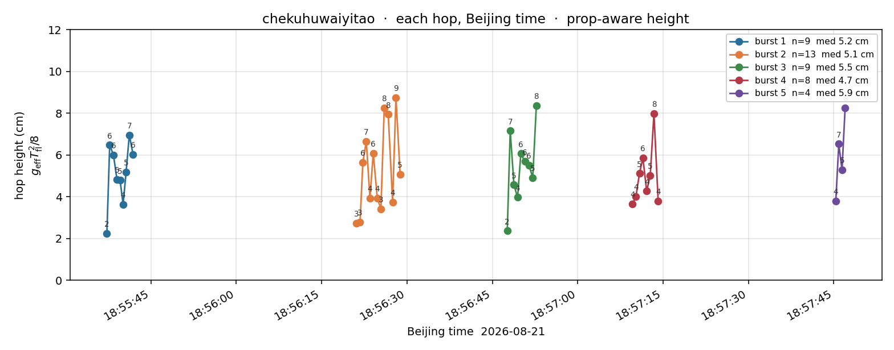

# chekuhuwaiyitao

Outdoor / 车库外 continuous run. 2026-08-21 18:54 BJ.

Source session: `chekuoutdoor1_20260821_1854BJ`  
CSV (not in this folder): `lcm_20260821_184629.csv`

Story clip **0:00 = 18:55:25**. The 51 s cut **0:00 = story 1:35 = 18:57:00**.

## Watch

Use the `.webm` files in GNOME Videos. VLC can play the `.mp4`.

| File | What |
|---|---|
| `chekuhuwaiyitao_135-226_bright.webm` | 1:35–2:26, brightened (51 s) |
| `chekuhuwaiyitao_135-226.mp4` | same window, original |
| `chekuhuwaiyitao_135-226_leg.png` | joints / RM / wheels for that window |
| `chekuhuwaiyitao_185525-185800_bright.webm` | full continuous story 2:31 |
| `chekuhuwaiyitao_leg_vs_mp4.png` | full story alignment |
| `chekuhuwaiyitao_hop_heights.png` | **each hop height vs Beijing time** |
| `chekuhuwaiyitao_hop_heights.json` | same numbers, per hop |

## Hop height (Beijing time)

LCM CSV has no `hop_height_m`. Each hop is a PWM-on / fold-arm-retracted flight island. Height is the prop-aware ballistic

\[
h = g_{\mathrm{eff}}\,T_{\mathrm{fl}}^{2}/8
\]

with \(g_{\mathrm{eff}}\) = median \(|a_z|\) in that flight (paddle is holding, so \(g_{\mathrm{eff}}\approx 2.5\)–\(4.5\,\mathrm{m/s}^2\), not \(9.81\)). First hop of a burst is usually the short cold start.

**43 hops** in five bursts. Median **5.2 cm**.

| Burst | Beijing start | Beijing end | Story | n | median \(h\) | range |
|---|---|---|---|---|---|---|
| 1 | **18:55:37.256** | 18:55:41.858 | 0:12 | 9 | 5.2 cm | 2.2–7.0 |
| 2 | **18:56:21.143** | 18:56:28.794 | 0:56 | 13 | 5.1 cm | 2.7–8.8 |
| 3 | **18:56:47.621** | 18:56:52.732 | 1:22 | 9 | 5.5 cm | 2.4–8.4 |
| 4 | **18:57:09.642** | 18:57:14.138 | 1:44 | 8 | 4.7 cm | 3.7–8.0 |
| 5 | **18:57:45.354** | 18:57:46.993 | 2:20 | 4 | 5.9 cm | 3.8–8.2 |

### Burst 1 — 18:55:37 BJ

| # | Beijing | Story | \(T_{\mathrm{fl}}\) | \(h\) |
|---|---|---|---|---|
| 1 | 18:55:37.256 | 0:12.3 | 0.270 s | 2.2 cm |
| 2 | 18:55:37.756 | 0:12.8 | 0.400 s | 6.5 cm |
| 3 | 18:55:38.415 | 0:13.4 | 0.365 s | 6.0 cm |
| 4 | 18:55:39.030 | 0:14.0 | 0.311 s | 4.8 cm |
| 5 | 18:55:39.580 | 0:14.6 | 0.280 s | 4.8 cm |
| 6 | 18:55:40.111 | 0:15.1 | 0.285 s | 3.6 cm |
| 7 | 18:55:40.636 | 0:15.6 | 0.325 s | 5.2 cm |
| 8 | 18:55:41.200 | 0:16.2 | 0.415 s | 7.0 cm |
| 9 | 18:55:41.858 | 0:16.9 | 0.395 s | 6.0 cm |

### Burst 2 — 18:56:21 BJ

| # | Beijing | Story | \(T_{\mathrm{fl}}\) | \(h\) |
|---|---|---|---|---|
| 1 | 18:56:21.143 | 0:56.1 | 0.278 s | 2.7 cm |
| 2 | 18:56:21.751 | 0:56.8 | 0.245 s | 2.8 cm |
| 3 | 18:56:22.241 | 0:57.2 | 0.345 s | 5.7 cm |
| 4 | 18:56:22.851 | 0:57.9 | 0.385 s | 6.7 cm |
| 5 | 18:56:23.486 | 0:58.5 | 0.350 s | 3.9 cm |
| 6 | 18:56:24.071 | 0:59.1 | 0.395 s | 6.1 cm |
| 7 | 18:56:24.781 | 0:59.8 | 0.325 s | 3.9 cm |
| 8 | 18:56:25.416 | 1:00.4 | 0.345 s | 3.4 cm |
| 9 | 18:56:26.001 | 1:01.0 | 0.480 s | 8.2 cm |
| 10 | 18:56:26.701 | 1:01.7 | 0.480 s | 8.0 cm |
| 11 | 18:56:27.471 | 1:02.5 | 0.355 s | 3.8 cm |
| 12 | 18:56:28.061 | 1:03.1 | 0.483 s | 8.8 cm |
| 13 | 18:56:28.794 | 1:03.8 | 0.411 s | 5.1 cm |

### Burst 3 — 18:56:47 BJ

| # | Beijing | Story | \(T_{\mathrm{fl}}\) | \(h\) |
|---|---|---|---|---|
| 1 | 18:56:47.621 | 1:22.6 | 0.280 s | 2.4 cm |
| 2 | 18:56:48.141 | 1:23.1 | 0.405 s | 7.2 cm |
| 3 | 18:56:48.797 | 1:23.8 | 0.332 s | 4.6 cm |
| 4 | 18:56:49.433 | 1:24.4 | 0.328 s | 4.0 cm |
| 5 | 18:56:50.007 | 1:25.0 | 0.405 s | 6.1 cm |
| 6 | 18:56:50.716 | 1:25.7 | 0.376 s | 5.7 cm |
| 7 | 18:56:51.427 | 1:26.4 | 0.369 s | 5.5 cm |
| 8 | 18:56:52.101 | 1:27.1 | 0.386 s | 4.9 cm |
| 9 | 18:56:52.732 | 1:27.7 | 0.466 s | 8.4 cm |

### Burst 4 — 18:57:09 BJ (in the 1:35–2:26 cut)

| # | Beijing | Story | \(T_{\mathrm{fl}}\) | \(h\) |
|---|---|---|---|---|
| 1 | 18:57:09.642 | 1:44.6 | 0.290 s | 3.7 cm |
| 2 | 18:57:10.238 | 1:45.2 | 0.316 s | 4.0 cm |
| 3 | 18:57:10.852 | 1:45.9 | 0.340 s | 5.1 cm |
| 4 | 18:57:11.457 | 1:46.5 | 0.360 s | 5.9 cm |
| 5 | 18:57:12.123 | 1:47.1 | 0.320 s | 4.3 cm |
| 6 | 18:57:12.749 | 1:47.7 | 0.344 s | 5.0 cm |
| 7 | 18:57:13.398 | 1:48.4 | 0.439 s | 8.0 cm |
| 8 | 18:57:14.138 | 1:49.1 | 0.390 s | 3.8 cm |

### Burst 5 — 18:57:45 BJ (after the box push)

| # | Beijing | Story | \(T_{\mathrm{fl}}\) | \(h\) |
|---|---|---|---|---|
| 1 | 18:57:45.354 | 2:20.4 | 0.295 s | 3.8 cm |
| 2 | 18:57:45.883 | 2:20.9 | 0.341 s | 6.5 cm |
| 3 | 18:57:46.448 | 2:21.4 | 0.321 s | 5.3 cm |
| 4 | 18:57:46.993 | 2:22.0 | 0.421 s | 8.2 cm |

## 1:35–2:26 (this cut)

| This file | Story | Wall (BJ) | Log |
|---|---|---|---|
| 0:00 | 1:35 | 18:57:00 | MOBILE |
| 0:09 | 1:44 | **18:57:09** | burst 4, 8 hops, median **4.7 cm** |
| 0:18 | 1:53 | 18:57:18 | wheels 6–9 rad/s, leg stowed |
| 0:25 | 2:00 | 18:57:25 | hold `(1.37, 1.37, −0.08)` + wheels push |
| 0:33 | 2:08 | 18:57:33 | leg back, wheels still moving |
| 0:45 | 2:20 | **18:57:45** | burst 5, 4 hops, median **5.9 cm** |
| 0:51 | 2:26 | 18:57:51 | MOBILE |
