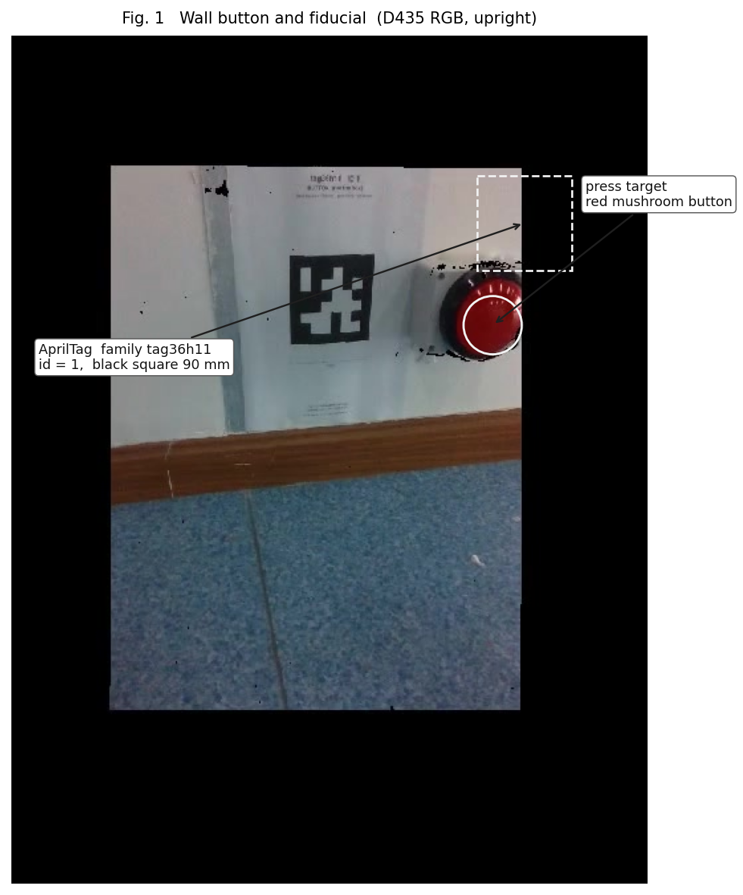
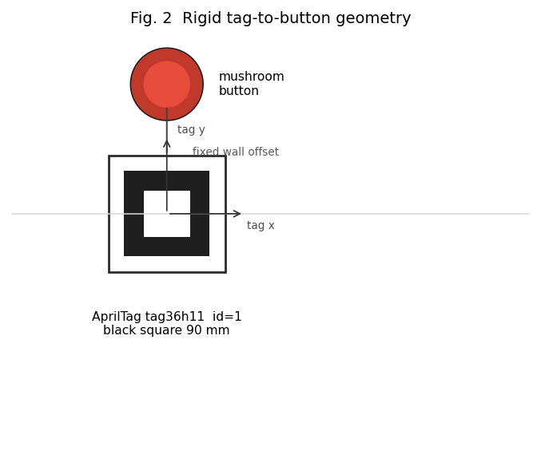

# Wall-button press with a single AprilTag

Hopper, indoor, 2026-08-21 16:16 BJ. The robot is in **MOBILE**. A RealSense D435 looks at a wall-mounted **red mushroom button**. Pose of the button is not measured directly: it is a **fixed rigid offset** from one printed AprilTag on the same wall.

This folder is the video + figures for that setup. The full LCM CSV is not included (109 MB).

## 1. Target

| | |
|---|---|
| Fiducial | AprilTag family **tag36h11**, **id = 1** |
| Printed black square | **90 mm** (controller `tag_size = 0.09 m`) |
| Sheet note | outer box marked 100 mm; inner pattern 80 mm |
| Press target | red industrial mushroom button, same wall plane |
| Camera | onboard D435 RGB, 640×480, ~15 Hz |

The tag sits on the wall next to / below the button (Fig. 1). Detecting id=1 gives \(T_{\mathrm{cam}\leftarrow\mathrm{tag}}\). The press point is then

\[
p_{\mathrm{press}}^{\mathrm{tag}}
=
\bigl(r,\; d,\; \ell - \delta\bigr),
\]

with the values used on this robot (tag frame: \(+X\) right on the print, \(+Y\) down, \(+Z\) out of the wall toward the camera):

| Symbol | Meaning | Value |
|---|---|---|
| \(r\) | along tag \(X\) (wall-right after the sign convention in code) | \(-0.195\) m |
| \(d\) | along tag \(Y\) | \(-0.056\) m |
| \(\ell\) | stand-off along tag \(Z\) (button face) | \(+0.050\) m |
| \(\delta\) | extra travel into the face | \(0.020\) m |

A hover / pre-press point sits 3 cm in front of the face. The same chain is \(T_{\mathrm{leg}\leftarrow\mathrm{cam}}\,T_{\mathrm{cam}\leftarrow\mathrm{tag}}\). Source: `tools/button_apriltag_geometry.py`.

## 2. What the robot does

1. **MOBILE**, wheels on. Perception looks for tag36h11 id=1 every color frame.
2. If the tag is seen but the press point is not in the leg workspace, **LT** starts a wheel approach (camera forward = stick forward).
3. When the press / pre points fit the workspace, the **leg** runs the press sequence (home → pre → face → press). It is supposed to **hold** the press pose.
4. Color exposure is capped near **4 ms** so the tag does not smear while the base moves. Indoor stills are usable; dusk footage is dark on purpose.

## 3. This trial (btn1616)

Five reaches, all from MOBILE, all toward the same id=1 button. None stayed in the press pose; each snap-back is to the mobile stow \(q \approx (0.30,\,-0.92,\,-0.53)\).

**Presses clip** `btn1616_presses_161735-161855*.mp4` — **0:00 = 16:17:35**.

| Attempt | Wall clock | Presses clip | 5 min clip | Notes |
|---|---|---|---|---|
| 1 | 16:17:41–46 | 0:06 | 1:38 | reach, then stow |
| 2 | 16:17:57–02 | 0:22 | 1:54 | reach, then stow |
| 3 | 16:18:12–16 | 0:37 | 2:09 | reach, then stow |
| 4 | 16:18:30–34 | 0:55 | 2:27 | reach, then stow |
| 5 | 16:18:47–52 | 1:12 | 2:44 | reach, then drive away |

The 5 min clip `btn1616_161603-162102_play.mp4` has **0:00 = 16:16:03** (approach + the five reaches). `btn1616_leg_vs_mp4.png` is joint angle / torque on those two time axes.

## 4. Files

| File | Use |
|---|---|
| `fig_button_apriltag.png` | Fig. 1 — button + tag from D435 |
| `fig_tag_button_geometry.png` | Fig. 2 — rigid offset |
| `still_button_tag.jpg` | unlabeled still |
| `btn1616_presses_161735-161855.mp4` | 80 s H.264 (VLC) |
| `btn1616_presses_161735-161855_play.mp4` | same, MPEG-4 |
| `btn1616_presses.webm` | same, for GNOME Videos |
| `btn1616_161603-162102_play.mp4` | 5 min approach + presses |
| `btn1616_leg_vs_mp4.png` | log aligned to the clips |

GNOME Videos: open the `.webm`. Cursor / Totem will not play the `_play.mp4` without an MPEG-4 decoder; use VLC or the webm.
