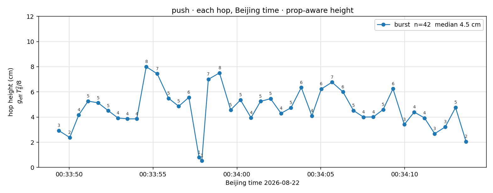

# push

Indoor MOBILE → HOPPING burst. 2026-08-22 **00:33** BJ.

Source on Jetson: `lcm_csv/lcm_20260822_002513.csv` (00:25:13–00:40:31).  
This folder is that window, renamed **`push.csv`** (00:33:20–00:34:30).

LCM CSV has no `gait_mode` / `hop_height_m`. Hopping is PWM-on with fold-arm retracted. Height is the prop-aware ballistic

\[
h = g_{\mathrm{eff}}\,T_{\mathrm{fl}}^{2}/8
\]

with \(g_{\mathrm{eff}}\) = median \(|a_z|\) in that flight (paddle is holding, so \(g_{\mathrm{eff}}\approx 2.5\)–\(3.7\,\mathrm{m/s}^2\), not \(9.81\)). Hops 15–16 are short split islands.

**42 hops**, 00:33:49–00:34:13 BJ. Median **4.5 cm** (range 0.5–8.0).

| | Beijing start | Beijing end | n | median \(h\) | range |
|---|---|---|---|---|---|
| burst | **00:33:49.390** | 00:34:13.654 | 42 | 4.5 cm | 0.5–8.0 |

| # | Beijing | \(T_{\mathrm{fl}}\) | \(h\) |
|---|---|---|---|
| 1 | 00:33:49.390 | 0.288 s | 2.9 cm |
| 2 | 00:33:50.034 | 0.234 s | 2.4 cm |
| 3 | 00:33:50.572 | 0.305 s | 4.2 cm |
| 4 | 00:33:51.129 | 0.339 s | 5.3 cm |
| 5 | 00:33:51.728 | 0.345 s | 5.1 cm |
| 6 | 00:33:52.328 | 0.319 s | 4.5 cm |
| 7 | 00:33:52.908 | 0.292 s | 3.9 cm |
| 8 | 00:33:53.468 | 0.290 s | 3.9 cm |
| 9 | 00:33:54.028 | 0.334 s | 3.9 cm |
| 10 | 00:33:54.592 | 0.416 s | 8.0 cm |
| 11 | 00:33:55.248 | 0.420 s | 7.4 cm |
| 12 | 00:33:55.928 | 0.350 s | 5.5 cm |
| 13 | 00:33:56.530 | 0.325 s | 4.9 cm |
| 14 | 00:33:57.135 | 0.365 s | 5.6 cm |
| 15 | 00:33:57.740 | 0.139 s | 0.8 cm |
| 16 | 00:33:57.906 | 0.148 s | 0.5 cm |
| 17 | 00:33:58.295 | 0.430 s | 7.0 cm |
| 18 | 00:33:58.960 | 0.426 s | 7.5 cm |
| 19 | 00:33:59.625 | 0.337 s | 4.6 cm |
| 20 | 00:34:00.210 | 0.370 s | 5.4 cm |
| 21 | 00:34:00.840 | 0.315 s | 4.0 cm |
| 22 | 00:34:01.405 | 0.350 s | 5.2 cm |
| 23 | 00:34:02.005 | 0.360 s | 5.5 cm |
| 24 | 00:34:02.625 | 0.335 s | 4.3 cm |
| 25 | 00:34:03.220 | 0.345 s | 4.7 cm |
| 26 | 00:34:03.835 | 0.370 s | 6.3 cm |
| 27 | 00:34:04.466 | 0.325 s | 4.1 cm |
| 28 | 00:34:05.025 | 0.421 s | 6.2 cm |
| 29 | 00:34:05.666 | 0.405 s | 6.8 cm |
| 30 | 00:34:06.318 | 0.378 s | 6.0 cm |
| 31 | 00:34:06.946 | 0.330 s | 4.5 cm |
| 32 | 00:34:07.541 | 0.317 s | 4.0 cm |
| 33 | 00:34:08.128 | 0.314 s | 4.0 cm |
| 34 | 00:34:08.713 | 0.335 s | 4.6 cm |
| 35 | 00:34:09.299 | 0.381 s | 6.2 cm |
| 36 | 00:34:09.974 | 0.295 s | 3.4 cm |
| 37 | 00:34:10.564 | 0.330 s | 4.4 cm |
| 38 | 00:34:11.179 | 0.355 s | 3.9 cm |
| 39 | 00:34:11.784 | 0.250 s | 2.7 cm |
| 40 | 00:34:12.414 | 0.295 s | 3.2 cm |
| 41 | 00:34:13.029 | 0.335 s | 4.8 cm |
| 42 | 00:34:13.654 | 0.211 s | 2.0 cm |

## Files

| File | What |
|---|---|
| `push.csv` | LCM log, 00:33:20–00:34:30 BJ (from `lcm_20260822_002513.csv`) |
| `push_hop_heights.png` | each hop vs Beijing time |
| `push_hop_heights.json` | same numbers, per hop |
