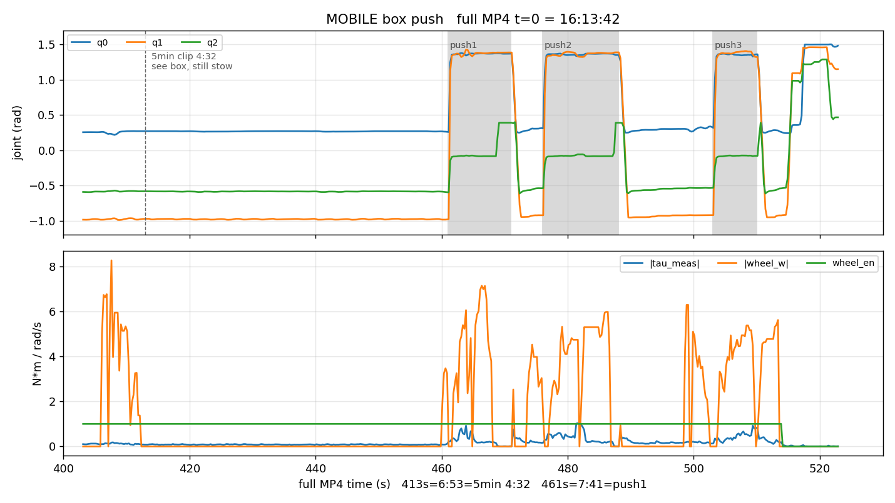

# pushbox

Indoor **box push only**. 2026-08-21 **16:21** BJ.

Same session as `demo/press buttom 4 times` (`btn1616`). After the five wall-button reaches (16:17:41–16:18:52), the robot drives to a box and pushes. This folder is that push, not the button presses.

Source LCM: `lcm_20260821_161332.csv` (16:13:32–16:30:16).  
This folder is the window renamed **`pushbox.csv`** (16:21:22–16:21:38). The 10 s onboard clip is **16:21:23–16:21:37**.

MOBILE the whole time. Props idle (PWM 1000). RM folded ~11.5 rad. Wheels enabled. Leg hold is about

\[
q \approx (1.36,\; 1.35,\; -0.08)
\]

(same hold used later in `chekuhuwaiyitao`). Wheel speeds during the push peak near 11–12 rad/s.

| | Beijing start | Beijing end | what |
|---|---|---|---|
| button presses (other demo) | 16:17:41 | 16:18:52 | five reaches, then stow |
| **this clip** | **16:21:23** | **16:21:37** | wheels on, leg in hold, box push |

## Files

| File | What |
|---|---|
| `pushbox.csv` | LCM log, 16:21:22–16:21:38 BJ |
| `btn1616_boxpush10s_162123-162137_play.mp4` | 10 s onboard, 0:00 = 16:21:23 |
| `btn1616_boxpush10s_162123-162137.mp4` | same, raw |
| `btn1616_boxpush_8s.webm` | tighter 8 s cut (GNOME Videos) |
| `btn1616_boxpush_8s.mp4` | same, H.264 |
| `btn1616_boxpush_wheels.webm` | wheels overlay, 16:21:23–16:21:50 |
| `btn1616_boxpush_leg.png` | joints / RM / wheels for the window |
