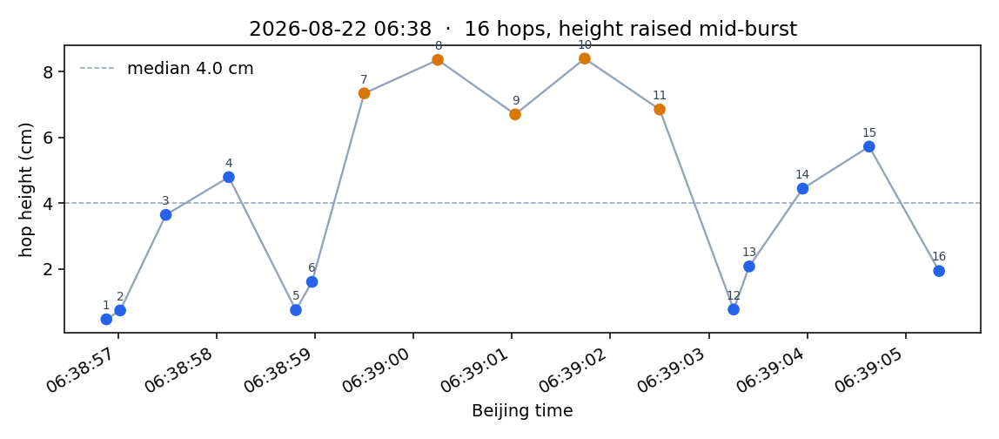

# 中途改高

Morning outdoor **mobile → ~16 hops → mobile**, hop height raised mid-burst. 2026-08-22 **06:38** BJ.

Jetson source: `lcm_csv/lcm_20260822_062758.csv`.  
This folder is the window renamed **`中途改高.csv`** (06:38:40–06:39:20). Camera `20260822_063405`. Depth not included.

LCM has no `gait_mode` / `hop_height_m`. From PWM / RM / wheels:

| | Beijing | what |
|---|---|---|
| mobile | **06:38:46–06:38:54** | wheels on, RM ~11.5 |
| **hopping** | **06:38:55–06:39:05** | PWM on, RM unfolded, ~10 s / **16 hops** |
| mobile | 06:39:05– | PWM off, RM folds back |

Height is the prop-aware ballistic

\[
h = g_{\mathrm{eff}}\,T_{\mathrm{fl}}^{2}/8
\]

with \(g_{\mathrm{eff}}\) = median \(|a_z|\) in that flight (paddle is holding, so \(g_{\mathrm{eff}}\approx 2.0\)–\(3.3\,\mathrm{m/s}^2\), not \(9.81\)). Islands shorter than 0.12 s dropped. Hops 5–6 and 12 are short split islands.

**16 hops**, 06:38:56–06:39:05 BJ. Median **4.0 cm**. Early hops ~0.5–5 cm; from **06:38:59.5** hops 7–11 are **6.7–8.4 cm**.

| # | Beijing | \(T_{\mathrm{fl}}\) | \(h\) |
|---|---|---|---|
| 1 | 06:38:56.883 | 0.130 s | 0.5 cm |
| 2 | 06:38:57.023 | 0.135 s | 0.7 cm |
| 3 | 06:38:57.487 | 0.310 s | 3.6 cm |
| 4 | 06:38:58.126 | 0.350 s | 4.8 cm |
| 5 | 06:38:58.807 | 0.134 s | 0.7 cm |
| 6 | 06:38:58.971 | 0.195 s | 1.6 cm |
| 7 | 06:38:59.501 | 0.427 s | 7.3 cm |
| 8 | 06:39:00.248 | 0.460 s | 8.4 cm |
| 9 | 06:39:01.034 | 0.402 s | 6.7 cm |
| 10 | 06:39:01.740 | 0.449 s | 8.4 cm |
| 11 | 06:39:02.501 | 0.425 s | 6.8 cm |
| 12 | 06:39:03.252 | 0.149 s | 0.8 cm |
| 13 | 06:39:03.410 | 0.230 s | 2.1 cm |
| 14 | 06:39:03.954 | 0.354 s | 4.4 cm |
| 15 | 06:39:04.628 | 0.385 s | 5.7 cm |
| 16 | 06:39:05.338 | 0.231 s | 1.9 cm |

## Files

| File | What |
|---|---|
| `中途改高.csv` | LCM window, 06:38:40–06:39:20 BJ |
| `中途改高_hop_heights.png` | each hop vs Beijing time |
| `中途改高_hop_heights.json` | same numbers, per hop |
| `color_0637-0639.avi` | RGB last ~80 s of `20260822_063405/seg000`（跳的前半段） |
| `color_0639-0640.avi` | RGB `seg001`（跳的后半段 + 切回 mobile） |
